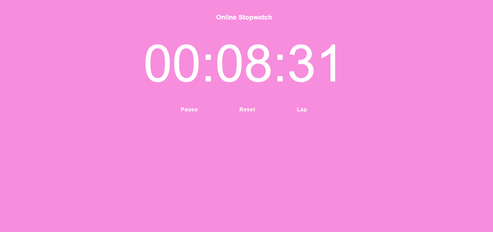

# Stopwatch Web Application

## Description
A simple stopwatch web application built using HTML, CSS, and JavaScript. This application allows users to start, pause, reset the stopwatch, and track lap times.

## Features
- **Start/Stop**: Start and stop the stopwatch.
- **Pause/Resume**: Pause the stopwatch and resume it from where it left off.
- **Reset**: Reset the stopwatch to zero.
- **Lap Times**: Track and display lap times.

## Technologies Used
- **HTML**: Structure of the application.
- **CSS**: Styling and layout of the application.
- **JavaScript**: Functionality for the stopwatch.

